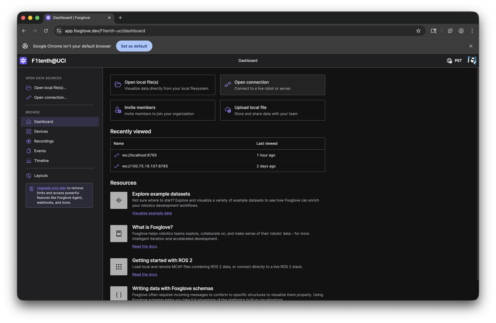
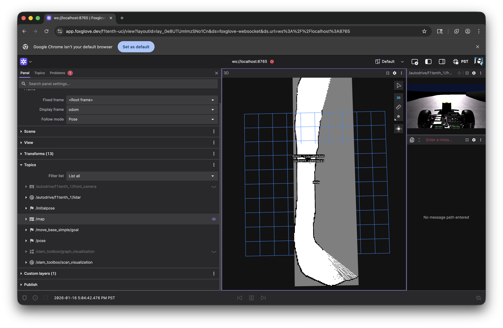

# Installation
## AutoDRIVE Simulator
### MacOS

The macOS installation guide is a bit lengthy, so please refer to [the macOS installation guide](macos.md).

## Windows

First, download the [AutoDRIVE Simulator](https://github.com/Tinker-Twins/AutoDRIVE/releases/download/Simulator-0.3.0/AutoDRIVE_Simulator_Windows.zip).

Then, double-click on the executable file. Should be open :D

## Linux

First, download [AutoDRIVE Simulator](https://github.com/Tinker-Twins/AutoDRIVE/releases/download/Simulator-0.3.0/AutoDRIVE_Simulator_Linux.zip).

Then, double-click on the executable file. Should be open :D

## Connecting to the simulator

### Installing uv

First, install uv, the Python package manager used by the UCI team.

#### Macos and Linux

```bash
curl -LsSf https://astral.sh/uv/install.sh | sh
```

Then close and reopen your terminal.

#### Windows

```bash
powershell -ExecutionPolicy ByPass -c "irm https://astral.sh/uv/install.ps1 | iex"
```

Then close and reopen your terminal.

### Installing git

#### Macos

Install command line developer tools

```
xcode-select --install
```

#### Windows

Install [git for windows](https://git-scm.com/downloads/win). The easiest way to do this is with winget, so in a terminal:

```bash
winget install --id Git.Git -e --source winget
```

### Running example_f1tenth.py

UV will automatically download the correct Python version and the required packages in a virtual environment managed by UV. Therefore, please refrain from using pip or venv on top of UV. Now you are ready to run example_f1tenth.py!

```bash
git clone https://github.com/uci-f1tenth/UCI_AutoDRIVE_labs
cd UCI_AutoDRIVE_labs
uv run src/example/example_f1tenth.py
```

### Connecting to AutoDRIVE

While `example_f1tenth.py` is running, open the AutoDRIVE application. Then click on "Manual" to switch it to Autonomous mode, and then click on "Disconnected" to connect.


Your car should now be driving forward automatically!

## ROS Setup
First, install the [devcontainer extension](https://marketplace.visualstudio.com/items?itemName=ms-vscode-remote.remote-containers) on vscode. 

Next, install some form of docker engine. I recommend [Orbstack](https://orbstack.dev/download) on macos for great performance. Docker desktop is also a solid tried-and-true choice on [linux](https://docs.docker.com/desktop/setup/install/linux/). Finally, on windows, please don't install anything, WSL will automatically install itself after a prompt on the next step.

Then open this repository in vscode, and open the command palette (command+shift+p). Select "Dev Containers: Rebuild and Reopen in Container." This will automatically build the docker container and open in in vscode.

Then, run the following commands, each in a different vscode terminal session, so they are all running at once in the vscode devcontainer:

### Run ros_bridge

```bash
cd src/autodrive_f1tenth && colcon build && cd ..
source autodrive_f1tenth/install/setup.bash
ros2 launch autodrive_f1tenth simulator_bringup_headless.launch.py
```

### Run Foxglove

```bash
ros2 launch foxglove_bridge foxglove_bridge_launch.xml
```

### Run slam_toolbox

```bash
ros2 launch slam_toolbox online_async_launch.py slam_params_file:=autodrive_online_async.yaml
```

### Run wall follow (optional)
```bash
cd src/lab1/wall_follow && colcon build && cd ..
source wall_follow/install/setup.bash
ros2 launch wall_follow wall_follow.launch.py
```

Then, open the AutoDRIVE Simulator, and click "Connect". The terminal session running `ros2 launch autodrive_f1tenth simulator_bringup_headless.launch.py` should say "Connected".

Then, make an account on [foxglove](https://foxglove.dev). Details of your sign up (such as which organization name) don't matter, you can just pick F1t@UCI (for example).

Then, open [foxglove](https://foxglove.dev) in a chromium based browser (such as google chrome), and click open connection:



Leave the defaults, and follow the prompts (you may need to enable unsafe scripts on some browsers).

Finally, open Foxglove, and toggle the visibility on the topcs you want to see (such as /map). You should now be able to see the car and the slam map!

